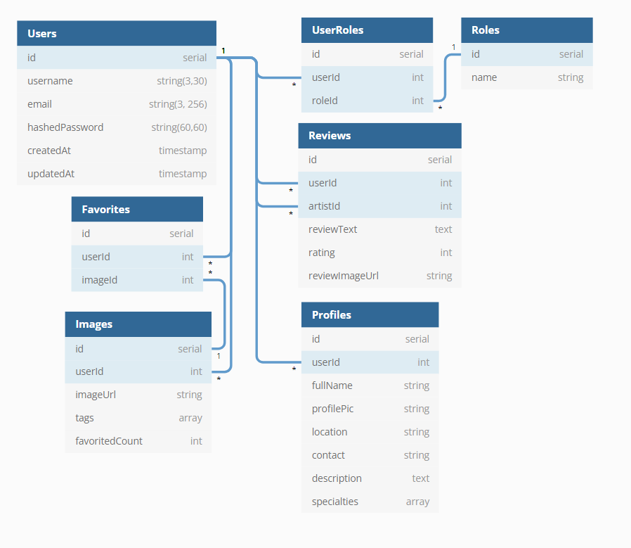

# Inkr

Inkr, inspired by [Flickr](https://www.flickr.com), is an image-sharing app where tattoo artists can post their portfolios. Users can interact with images by favoriting them, and also post reviews for artists.

[MVP Feature List](https://github.com/choi-jihoon/inkr/wiki/MVP-Feature-List)

[Database Schema](https://github.com/choi-jihoon/inkr/wiki/Database-Schema)

# Getting started

1. Clone this repository

   ```git clone git@github.com:choi-jihoon/inkr.git```

2. CD into the backend directory and install dependencies

    ```npm install```

3. CD into the frontend directory and install dependencies

    ```npm install```

4.  Create a .env file based on the .env.example given

5.  Create a user in psql based on your .env DB_USERNAME

    ```psql -c "CREATE USER <username> PASSWORD '<password>' CREATEDB"```

6. Create the database, migrate, and seed

    ```npx dotenv sequelize db:create```

    ```npx dotenv sequelize db:migrate```

    ```npx dotenv sequelize db:seed:all```

7. Open up two terminals and cd into the backend and frontend directories, respectively. Start the server in each by running:

	```npm start```


# Database Schema

