# Inkr

Inkr, inspired by [Flickr](https://www.flickr.com), is an image-sharing app where tattoo artists can post their portfolios. Users can interact with images by favoriting them, and also post reviews for artists.

All features update the page the user is on without a refresh of the page through use of the Redux store.

- [Live Site](https://inkr.herokuapp.com/)
- [MVP Feature List](https://github.com/choi-jihoon/inkr/wiki/MVP-Feature-List)
- [Database Schema](https://github.com/choi-jihoon/inkr/wiki/Database-Schema)

# Technologies Used


# Getting started

1. Clone this repository

   ```git clone git@github.com:choi-jihoon/inkr.git```

2. CD into the backend directory and install dependencies

    ```npm install```

3. CD into the frontend directory and install dependencies

    ```npm install```

4.  Create a .env file based on the .env.example given

5.  Create a user in psql based on your .env DB_USERNAME

    ```psql -c "CREATE USER <username> PASSWORD '<password>' CREATEDB"```

6. Create the database, migrate, and seed

    ```npx dotenv sequelize db:create```

    ```npx dotenv sequelize db:migrate```

    ```npx dotenv sequelize db:seed:all```

7. Open up two terminals and cd into the backend and frontend directories, respectively. Start the server in each by running:

	```npm start```


# Features

## Splash Page & User Authentication

Users can log into an existing account or sign up. Alternatively, users can test the site with the Demo Login feature.

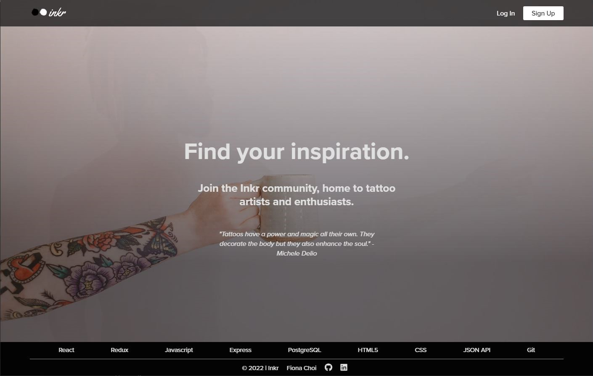
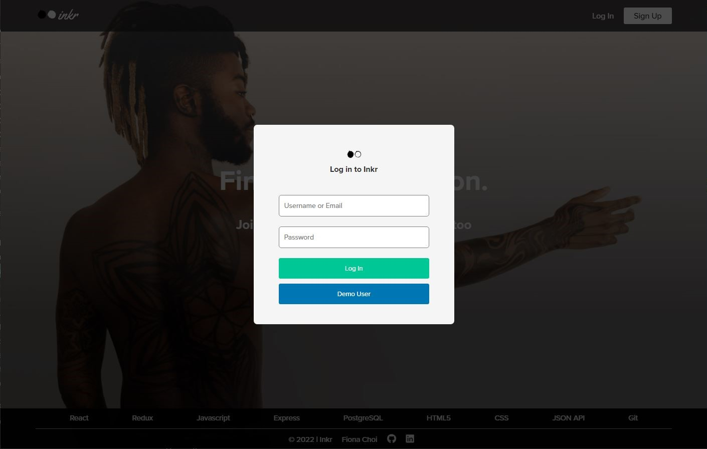

## User Home Page

### Navigation
- The tab that is currently being displayed is shown on the navigation bar.

Once the user is logged in, they can view all images posted on the app.
- Hovering over images shows a Favorites button (a star) and a Favorites count
- Clicking the star adds the image to the user's favorited images, which can be seen in the user's Favorite's tab
- Favorited images display the star in the corner without hovering
- Clicking on an image will display a zoomed in modal of that image, with the image's tags and the username of the user who posted the image.
  - Clicking on the username renders the portfolio of the artist.

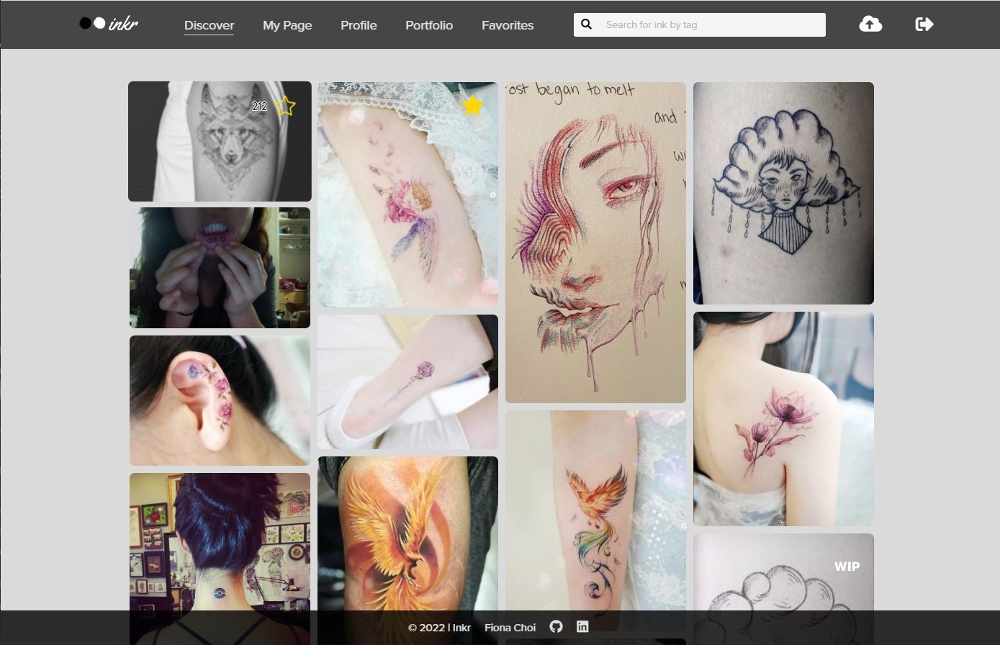
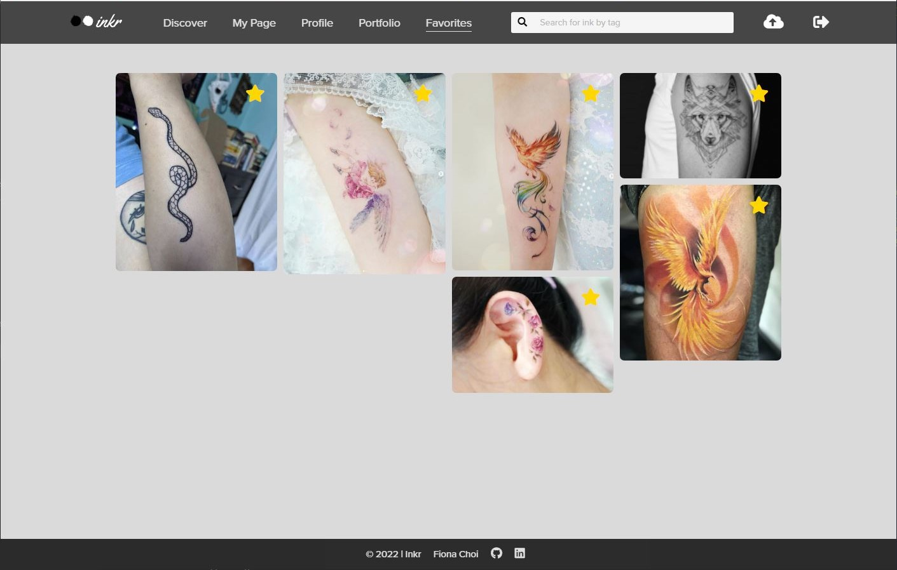
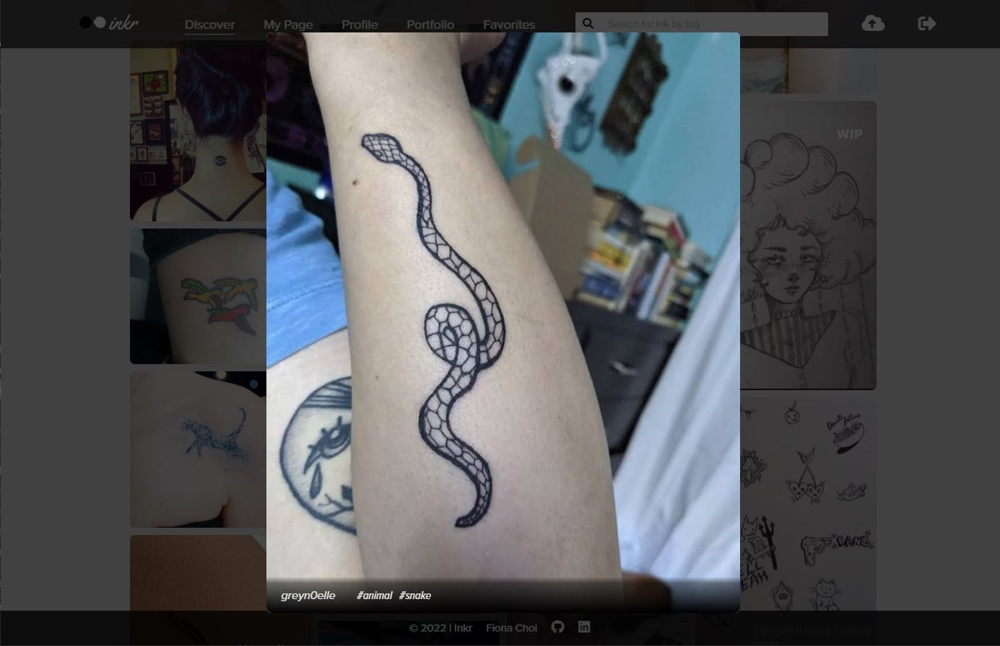


## Images

A user can post a new image by clicking the upload icon in the navigation bar, edit the tags for an image they've posted, and delete images they've posted.
- Edit and delete buttons only show up on hover to achieve a clean look on the site.

These features are available anywhere the image can be viewed (Discover, My Page, and Portfolio).

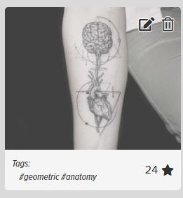
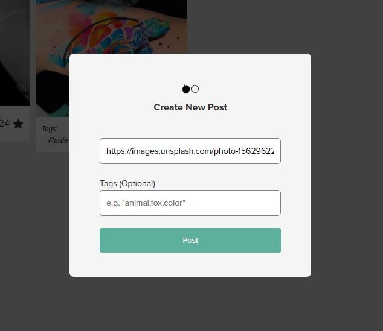
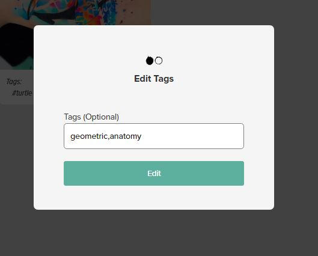
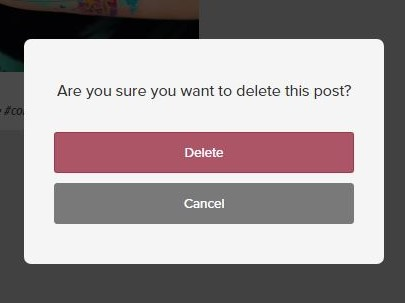


## Profiles

A user can edit their profile from their Profile tab. This information is displayed in the user's public page.

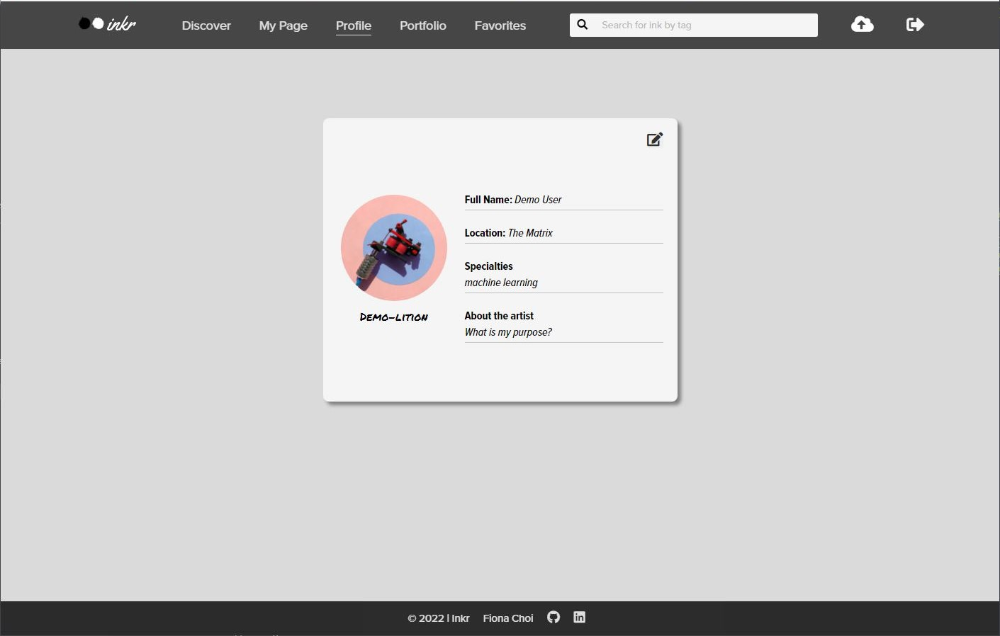


## Reviews

Navigating to an artist's page (or the User page through the 'My Page' tab) displays the artist's profile, the images they've posted, as well as reviews for that artist (intended for their experience getting tattooed by them).

On this page, users can add a review, as well as delete reviews they've created. The delete button displays only for reviews that belong to the logged in user and appears on hover to achieve the clean look of the app.

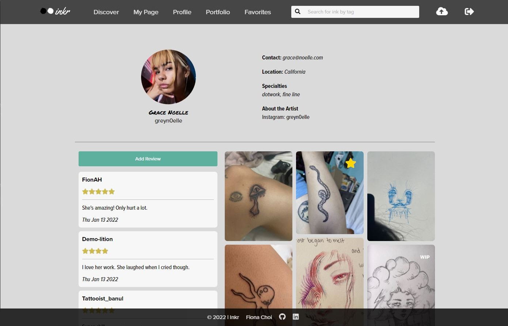


## Search

Users can search for images by an associated tag from the search bar.

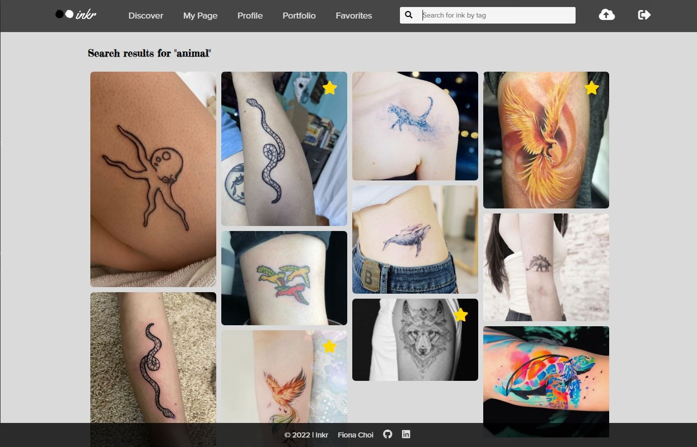


## Developer

Clicking on the corresponding link in the footer will direct users to the site's github repo, my own profile page, Github, or LinkedIn by opening another tab.

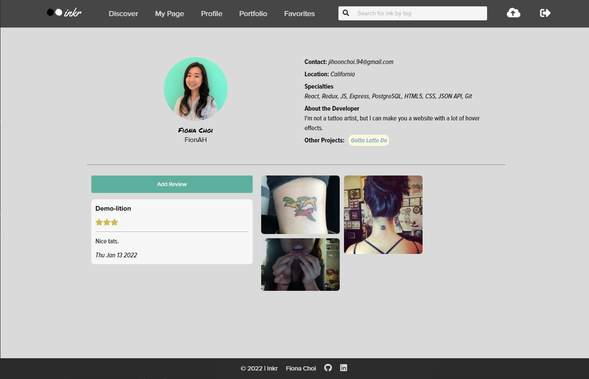


## Page Not Found

Trying to access a path that does not exist or is not available because the user is not signed in will render a page not found component, and redirects the user to the home page automatically after 3 seconds.

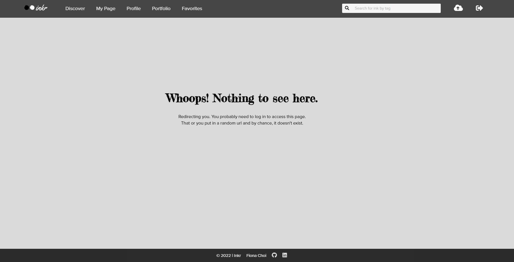


## Upcoming Features

- Infinite scroll on user main page
- User roles with separated features to distinguish from artists and consumers
- Ability to message and book appointments with artists
- Notifications for artists when a new review or message has been received


# Database Schema

